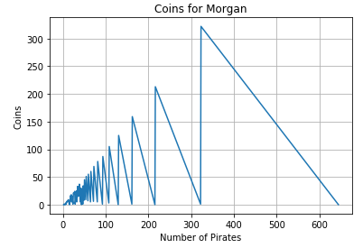

Lets begin by finding the amount of golden coins that are in the treasure. We can call that amount X, and we now that, after splitting
the treasure in equal parts for a group of 99 pirates, Morgan recieves 51 coins. If he choose a group of 77 he receives 29 coins. This
means that if we divide X by 99 the remainder is 51, and dividing X by 77 has remainder 29.

Then we can write:

_X=99q+51_ and _X=77k+29_ 

Where _q_ and _k_ are positive integers greater than 1 representing the amount of coins that a pirate recieve in each case. Now we can join both equations to get:

_99q+51=77k+29_  ---->    _11(9q-7k)=-22_ ---->   _9q-7k=-2_

To find _q_ and _k_ we can use a grid search, mathematically we are trying to solve two diophantine equations, but in this case is very simple because
we can see that if _q_ and _k_ were 3 and 4 respectively we will have _9x3-7x4=-1_ and multiplying by 2 in both sides allow us to write _9x6-7x8=-2_. We can
conclude that _q=6_ and _k=8_ (it can be shown using chinese  remainder theorem that this solution is unique). And, as a result, X=645

Now we want to find how many pirates maximize the amount of coins for Morgan. It's important to remember that Morgan always gets the remainder
after splitting in equal parts. Then we can think that given a number of pirate P the maximum amount that morgan can recieve (if he choose wisely)
is P-1. For example if he take a group of 2 pirates each pirate will recieve 322 coins and Morgan 1. But if he choose (not so wisely) groups of 5 instead, each
pirate will recieve 129 coins and Morgan none. For the optimum amount of pirates we have that:

_645=Pc+P-1_

Where _P_ is the amount of pirates and _c_ is the coins that each pirate will recieve. P-1 represents what Morgan gets as remainder. We can rewrite
the equation as:

_645=P(c+1)-1_ -----> _646=P(c+1)_  Where _c_ has to be greater than 0.

We would like to find the larger value for P for the las equation, because greater P means greater remainder P-1 for Morgan. This makes a lot of sense because smaller groups will let less remainder.

As 646 is even and _c_ must be at least 1, we can choose _c=1_ and, then we have that _P=323_. As _c_ can not be smaller than 1, then _P_ can not be greater than 323. We can conclude that if Morgan choose a group of 323 pirates he will recieve 322 coins, and thats the maximum he could get.

Given a number of pirate morgan always recieve the remainder of dividing 645 by the number of pirates.

The following plot shows the coins that Morgan will recieve for each number of pirates in the group.

